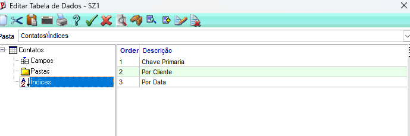
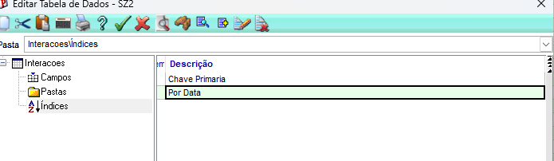
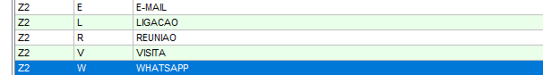

# Exercício 1 — Dicionário de dados completo

foto das tabelas SZ2 e SZ3  

indices nas tabelas SZ2 e SZ3 
SZ1 ordem 1: Z1_FILIAL + Z1_CODIGO
SZ2 ordem 1: Z2_FILIAL + Z2_CONTAT + Z2_SEQUEN

campos criados na tabela de dominio(SX5)

E E-mail
L Ligação
R Reunião
V Visita
W WhatsApp

